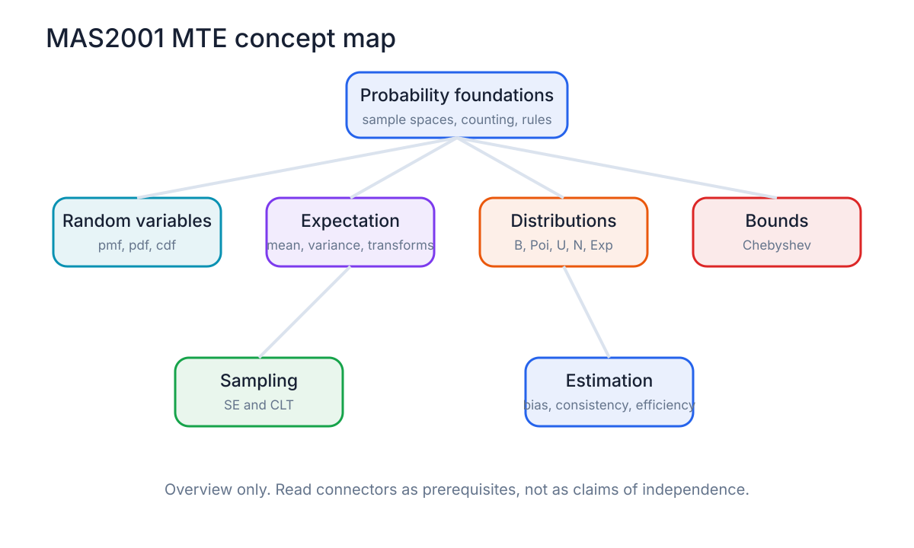
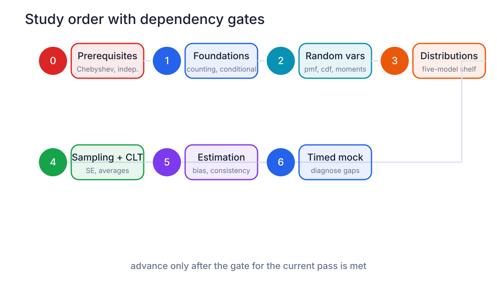
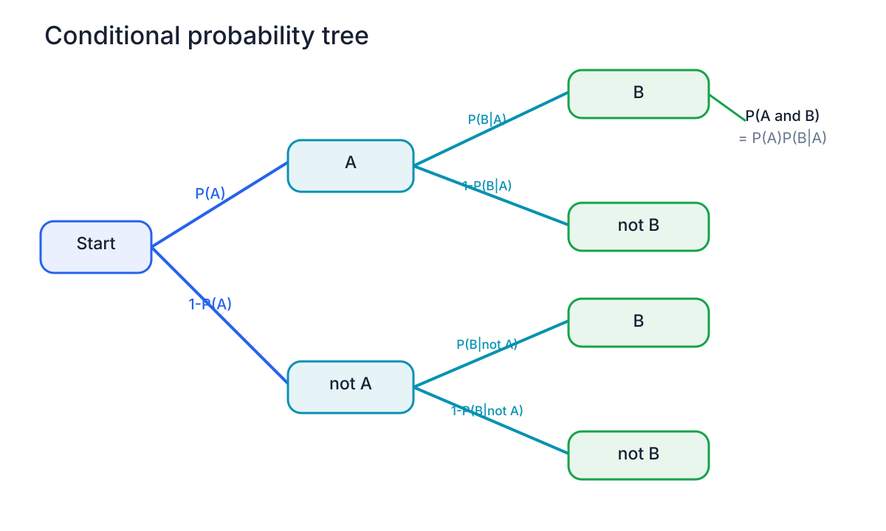
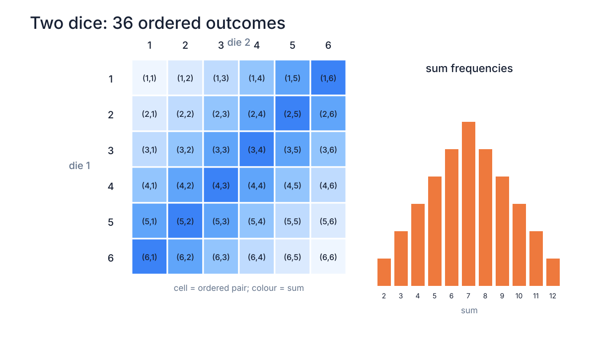
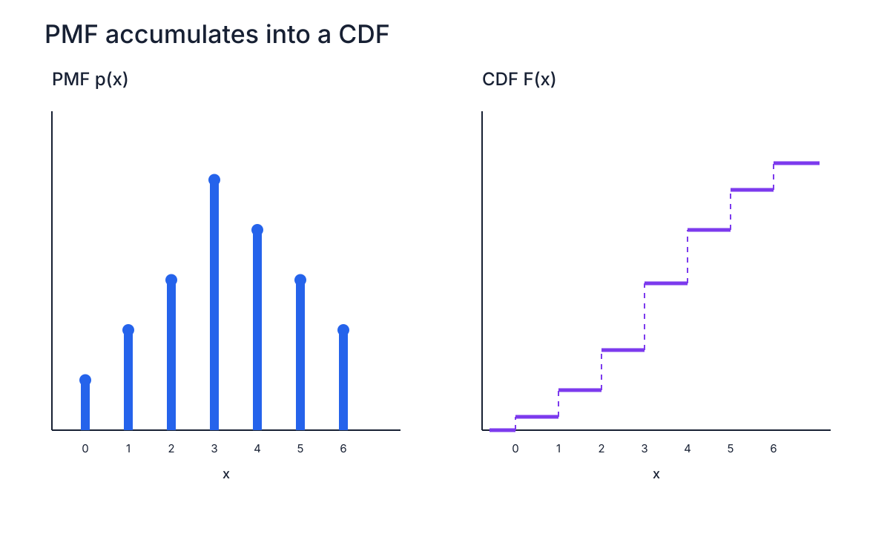
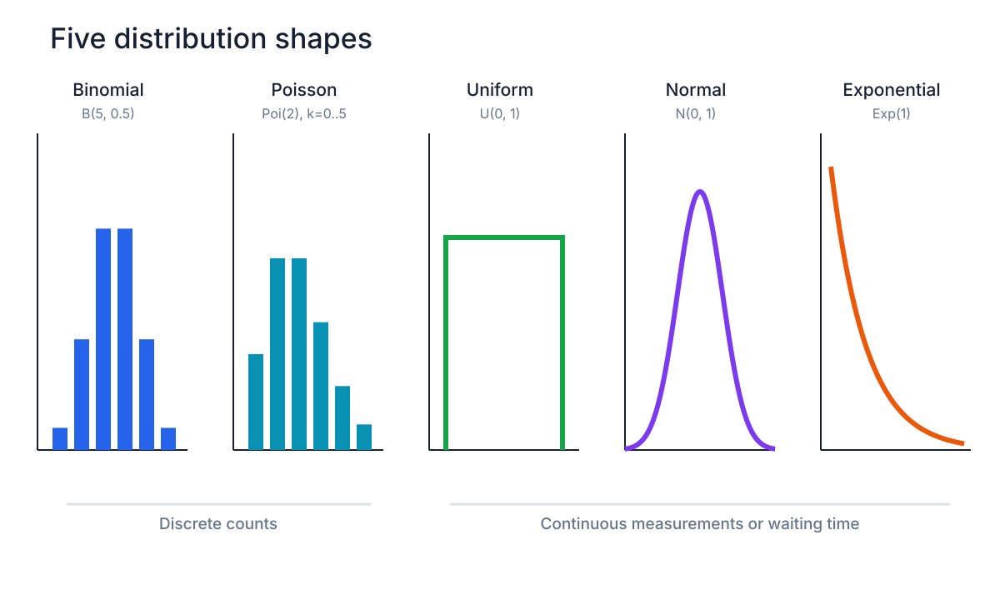
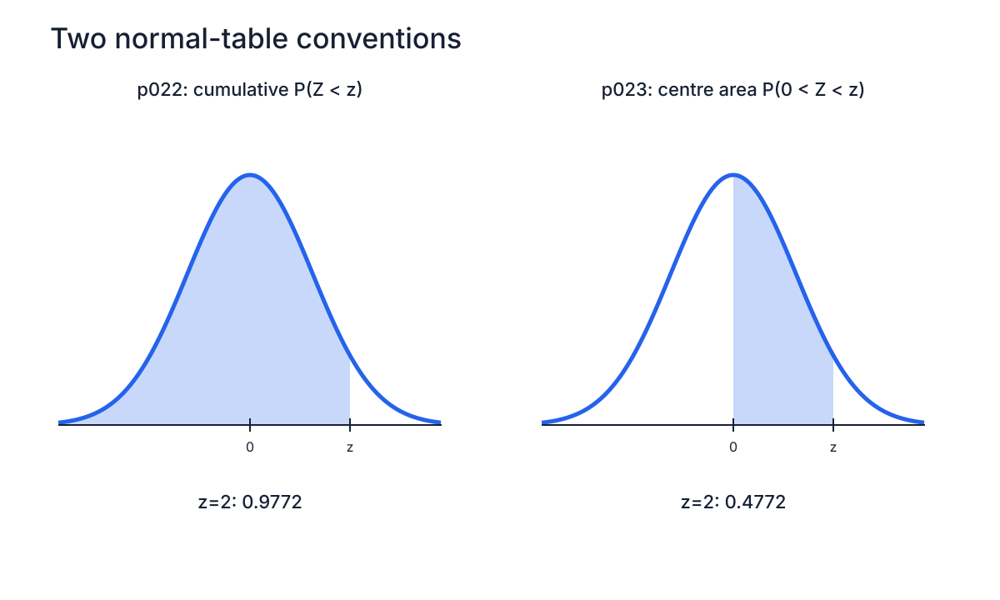
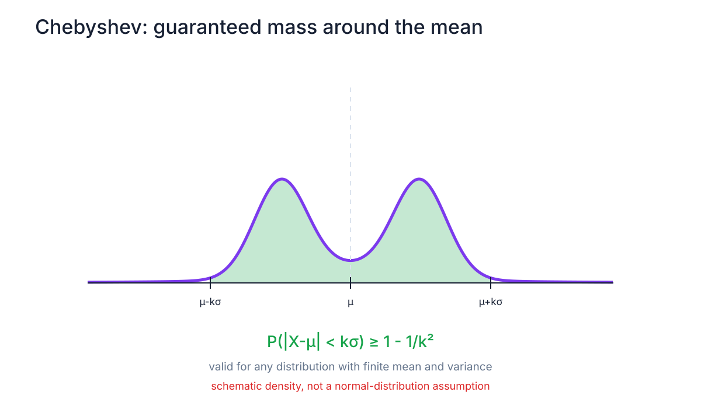
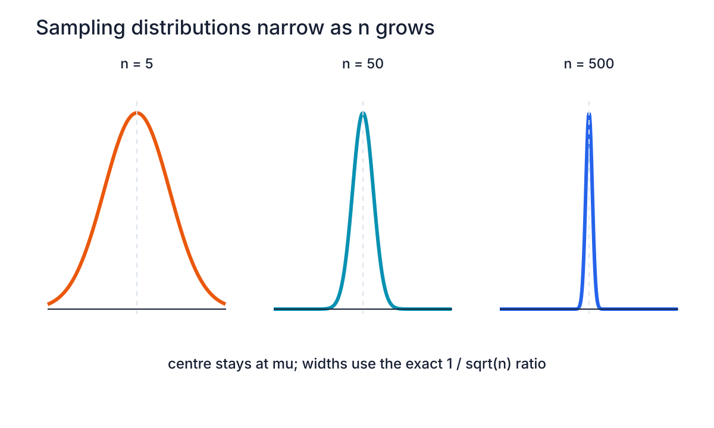
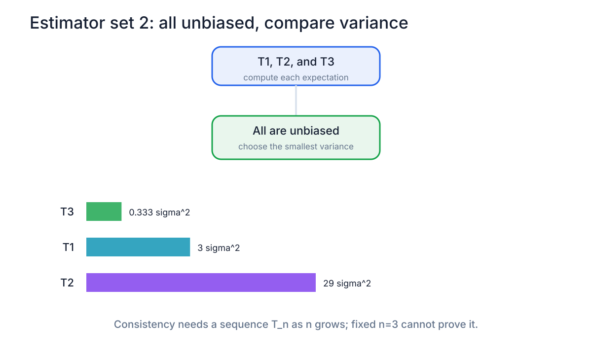

# Visual gallery

These are generated from `build_visuals.py`. Open any image directly for the full scalable version.

## Course structure

## Probability and random variables

## Distributions and bounds

## Sampling and estimation

